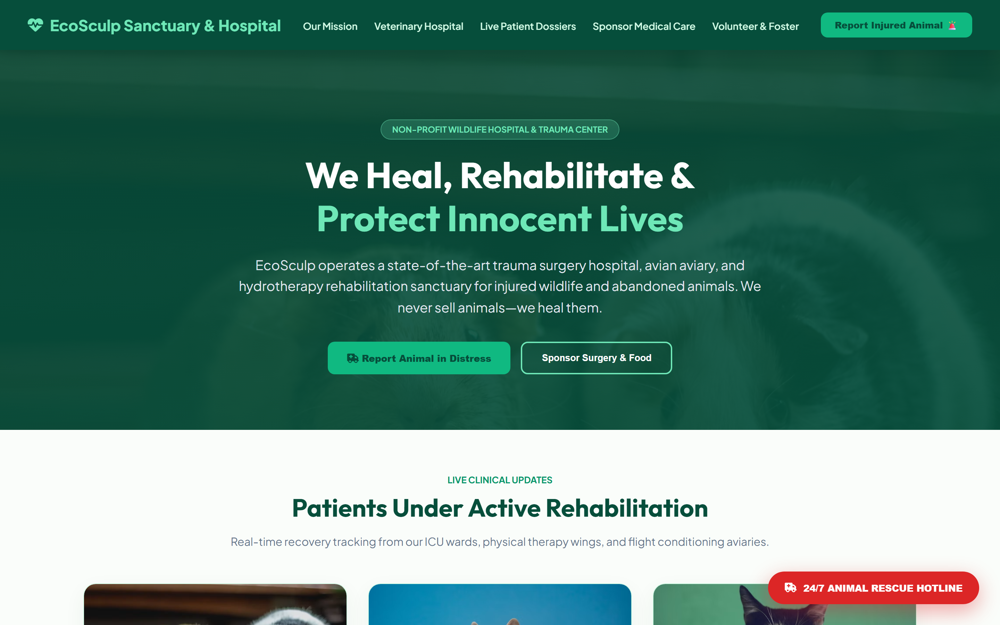

# pet-store-responsive-ui

## Visual Preview

  

Frontend web application managing user interface state and layout rendering.

Tech stack: html, css

How to run: clone repository, install dependencies, and start the local server.

Live demo: https://ecosculp-pet-store.pages.dev
